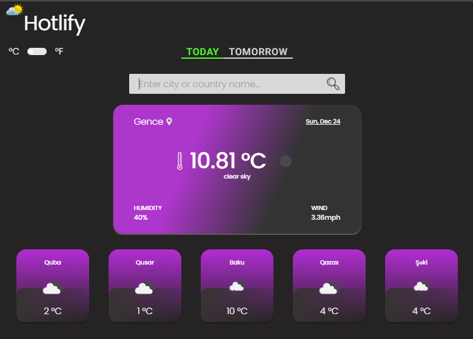

# Current Temperature - Weather App

### Screenshot Weather App



## Introduction
Awesome Weather App is a modern web application built with React, Redux Toolkit, TypeScript, Vite, and Tailwind CSS. 

It provides real-time weather updates with a clean and user-friendly interface.

## Features
- Real-time weather data
- Temperature units toggle (Celsius/Fahrenheit)
- Responsive design for various devices
- Recent searches for quick access
- User-friendly and intuitive interface


## Packages Used


| Name                  | Links | Description |
|-----------------------| ------| ----------- |
| ReactJs               | [React](https://reactjs.org/) | React is a free and open-source front-end JavaScript library for building user interfaces based on UI components.|
| TypeScript   | [TypeScript](https://www.typescriptlang.org/)  | TypeScript is a free and open-source programming language developed and maintained by Microsoft. It extends JavaScript by adding static typing, enabling developers to catch errors early in the development process.|
| React Router Dom      | [ReactRouterDom](https://reactrouter.com/en/main) | React Router DOM is an npm package that enables you to implement dynamic routing in a web app. It allows you to display pages and allow users to navigate them. |
| React Icons           | [ReactIcons](https://react-icons.github.io/react-icons/) | All Popular Icons in single package. |
| Tailwind CSS          | [TailwindCSS](https://tailwindcss.com/) | TailwindCSS is a framework like no other. Rather than constraining you to a set design, it gives you the tools and the standardization to build exactly what you want.|
| Redux Toolkit                    | [Redux Toolkit](https://redux-toolkit.js.org/) | Redux Toolkit is the official, opinionated, batteries-included toolset for efficient Redux development. It includes utilities for simplifying several common Redux use cases. |
| Axios   | [Axios](https://axios-http.com/) | Axios is a promise-based HTTP client for the browser and Node.js. It simplifies the process of making HTTP requests and handling responses. |


## Project Structure
Explain the structure of your project, detailing the purpose of each important file and folder.

 ```bash
src/                  # Root directory for the source code
|-- app/              # Redux Toolkit store setup
|-- assets/           # Images and other assets
|-- components/       # Reusable React components
|-- features/         # Redux Toolkit Slices for application features
|-- helper/           # Helper modules
|-- pages/            # React pages
|-- partials/         # Partial components
|-- routes/           # Application routes
|-- types/            # TypeScript type definitions (Prop types)
|-- utils/            # Utility functions
|-- App.tsx/          # Main application component
|-- index.tsx/        # Entry point
|-- constants/        # Constants and variables
|-- global.d.ts/      # Global TypeScript declarations
|-- index.css/        # Main stylesheet

```
## Prerequisites

Before you begin, ensure you have the following installed:

- Node.js: [https://nodejs.org/](https://nodejs.org/)
- npm: [https://www.npmjs.com/](https://www.npmjs.com/)

### Installation
 1. Clone the repository:
  ```bash
  git clone https://github.com/ElxanCivishov/weatherApp.git
  ```
 2. Change into the project directory:
 ```bash
 cd weather
 ```
 3. Install dependencies:
 ```bash
 npm install
 ```

### Usage

Run the development server:
 ```bash
 npm run start
 ```
Visit http://localhost:3000 in your browser.

Build the production-ready application:
 ```bash
npm run build
 ```


